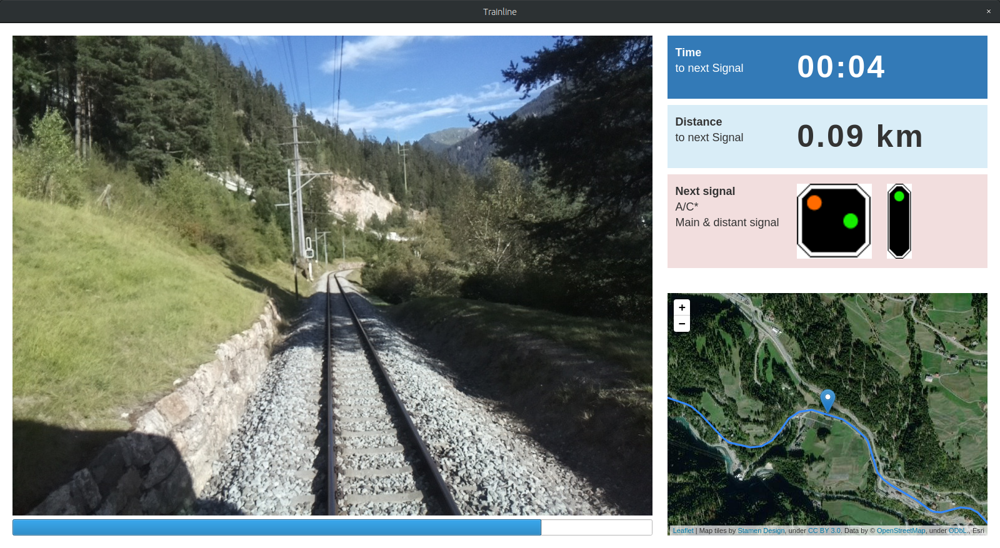

# VeilAway



## setup

```
python3.7 -m venv env
source env/bin/activate
pip install -r requirements.txt
```

## run

```
python src/main.py
```
## Problem statement

```
Imagine yourselves sitting in a cozy seat of the scenic world-heritage railway track of the Rhaetian Railway, driving over the iconic Landwasserviaduct. You sip a cup of hot tea while it is raining cats and dogs, so much you can't really spot the beautiful landmarks. What is for you a bad coincidence can be daily business for railway drivers. They can't see the track side safety elements such as signals and signs. Reducing the reaction time of the driver, bad weather can have fatal consequences, if no precautions are taken.
```

## Proposed solution

```
Reducing the speed of travel doesn’t come at the desired consumer satisfaction. This is where we present Trainline, an augmented reality assistant to the train driver. By showing nice-weather pictures with overlaid information of the next signals, the train driver can make well-informed decision about accelerating or decelerating the vehicle.
```

## Technical description

```
Leveraging the open-source mapping data available on [OpenRailwayMap](https://www.openrailwaymap.org/) (ORM), the dataset giving the relative position of the signals and other specific objects was extended with other GPS coordinates of the track. This extension provided a relative distance for all points extracted from ORM (calculating the geodesic distance between successive points), and allowed to complete the missing GPS information for all objects (using linear interpolation between the relatively dense ORM point set). The combined dataset was then used as a lookup table, to map the images (which contain approximate GPS coordinates in their EXIF metadata) to relative positions along the paths (using a kD-tree to find out what the nearest neighbour on the track is).
The relative position is used as a central value in our application, scheduling the whole system. This is also relevant for a real deployment, because the distance measurement can be measured in a more stable fashion (especially in tunnels) than the GPS signal. The "drift" issue (distance from start not accurate anymore, which could happen just by doing manoeuvres on the track) can be taken care of by using the GPS signal, but ensuring it is of goodquality.
```